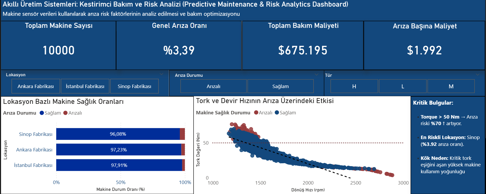

# Smart Manufacturing: Predictive Maintenance & Risk Analysis System  
#  Akıllı Üretim: Kestirimci Bakım ve Risk Analizi Sistemi  

**SQL | Python | Power BI | Databricks**

---
###  Project Overview
This project presents a **Decision Support System (DSS)** designed to monitor industrial sensor data and analyze equipment failure risks. By integrating **SQL** for data exploration, **Python** for statistical analysis and machine learning, and **Power BI** for visualization, raw sensor data is transformed into actionable business insights.

---

###  Key Business Insights
- **Financial Impact:** Developed a "Cost per Failure" metric ($1,992) to quantify the economic loss of downtime.
- **Root Cause Discovery:** Identified that **Torque values above 50 Nm** are associated with a **~70% increase** in failure probability.
- **Geographical Risk:** Determined that the **Sinop plant** has the highest failure rate (**3.92%**) based on proportional analysis.

---

###  Technical Architecture

#### 1. Data Analysis (SQL)
Used **SparkSQL in Databricks** to perform exploratory data analysis (EDA), including:
- Failure rate calculations
- Aggregations by machine type and location
- Sensor-based statistical summaries

#### 2. Modeling & Analysis (Python)
- Performed data preprocessing and statistical analysis using **Pandas & NumPy**
- Built a **Random Forest Classifier** to evaluate feature importance and validate critical thresholds
- Identified key variables influencing failure risk

#### 3. Visualization (Power BI)
- Designed an interactive dashboard using **Advanced DAX**
- Visualized failure risk patterns and operational insights
- Implemented threshold-based analysis (e.g., Torque > 50 Nm)

---

###  Model Performance
- **Model:** Random Forest Classifier  
- **Accuracy:** 99.9%  
- **Precision:** 100% (Class 0), 98% (Class 1)  
- **Recall:** 100% (Class 0), 98% (Class 1)  
- **F1-Score:** 99%  

---

###  Key Features Impacting Failures
- **Torque** (Highest Impact)  
- **Rotational Speed** - **Air Temperature** ---

  
----

###  Proje Özeti
Bu proje, endüstriyel sensör verilerini analiz ederek ekipman arıza risklerini incelemek amacıyla geliştirilmiş bir **Karar Destek Sistemidir (DSS)**. **SQL** ile veri keşfi, **Python** ile istatistiksel analiz ve makine öğrenmesi, **Power BI** ile görselleştirme yapılarak ham veriler işlenebilir içgörülere dönüştürülmüştür.

---

###  Temel Ticari İçgörüler
- **Finansal Etki:** Operasyonel duruşların maliyetini ölçmek için "Arıza Başına Maliyet" ($1.992) metriği geliştirilmiştir.
- **Kök Neden Tespiti:** **50 Nm üzerindeki Tork değerlerinin**, arıza riskini yaklaşık **%70 artırdığı** belirlenmiştir.
- **Coğrafi Risk:** Oransal analiz sonucunda en riskli lokasyonun **Sinop Fabrikası (%3,92)** olduğu tespit edilmiştir.

---

###  Teknik Mimari

#### 1. Veri Analizi (SQL)
Databricks üzerinde **SparkSQL** kullanılarak:
- Arıza oranı hesaplamaları
- Makine tipi ve lokasyona göre agregasyonlar
- Sensör verilerine dayalı özet analizler gerçekleştirilmiştir

#### 2. Modelleme ve Analiz (Python)
- **Pandas & NumPy** ile veri ön işleme ve analiz
- **Random Forest** modeli ile değişken önem düzeylerinin incelenmesi
- Arıza riskini etkileyen temel faktörlerin belirlenmesi

#### 3. Görselleştirme (Power BI)
- **İleri Düzey DAX** kullanılarak interaktif dashboard geliştirilmiştir
- Sensör verilerine dayalı risk analizleri görselleştirilmiştir
- Kritik eşik analizi (Torque > 50 Nm) uygulanmıştır

---

###  Model Performansı
- **Model:** Random Forest  
- **Doğruluk (Accuracy):** %99,9  
- **Keskinlik (Precision):** %100 (Sağlam), %98 (Arızalı)  
- **Duyarlılık (Recall):** %100 (Sağlam), %98 (Arızalı)  
- **F1-Skoru:** %99  

---

###  Arızayı Etkileyen Temel Değişkenler
- **Tork** (En Yüksek Etki)  
- **Dönüş Hızı** - **Hava Sıcaklığı** ---

###  Dashboard Preview / Panel Görünümü

---

###  About Me
Developed by a Statistics graduate specializing in Data Analytics and industrial data-driven decision systems.  
İstatistik mezunu bir veri analisti tarafından veri odaklı karar sistemleri geliştirme amacıyla hazırlanmıştır.

---

 **Connect / İletişim:** [LinkedIn Profile](https://www.linkedin.com/in/esracan-da/)
